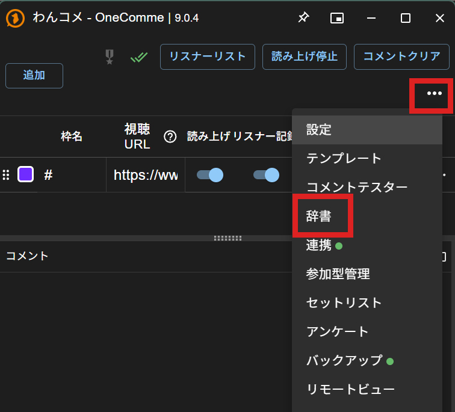
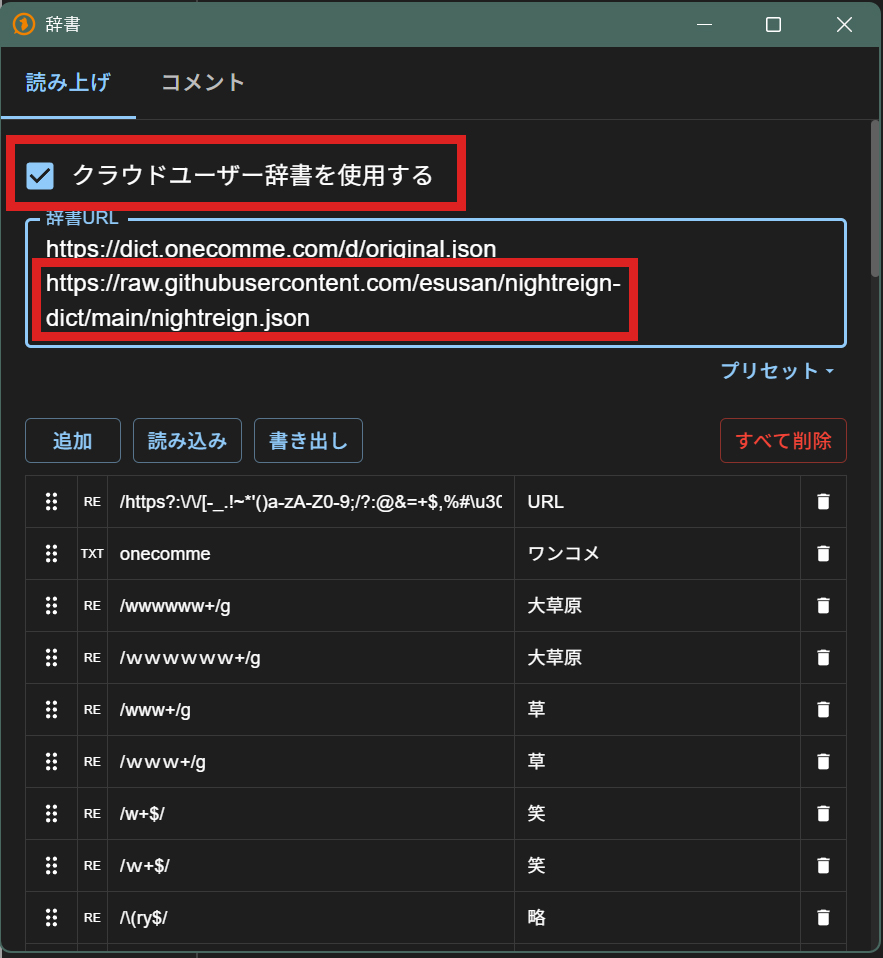

# nightreign-dict

ELDEN RING NIGHTREIGN の配信でよく出てくる用語を、わんコメの読み上げが正しく読めるようにするためのクラウドユーザー辞書です。

現在 207 語収録（`nightreign.json`）。

## 使い方（わんコメ側の設定）

1. わんコメ右上の「...」メニューから「辞書」を開く

   

2. 辞書ウィンドウの「読み上げ」タブで「クラウドユーザー辞書を使用する」にチェックを入れ、辞書URL欄に以下を追加する

   ```
   https://raw.githubusercontent.com/esusan/nightreign-dict/main/nightreign.json
   ```

   

設定後、わんコメが辞書URLを再取得したタイミング（起動時など）で自動的に反映されます。

## 単語の追加リクエスト

読み違えてる単語を見つけたら、Issueか [X](https://x.com/u_se_nr) まで連絡してください。
