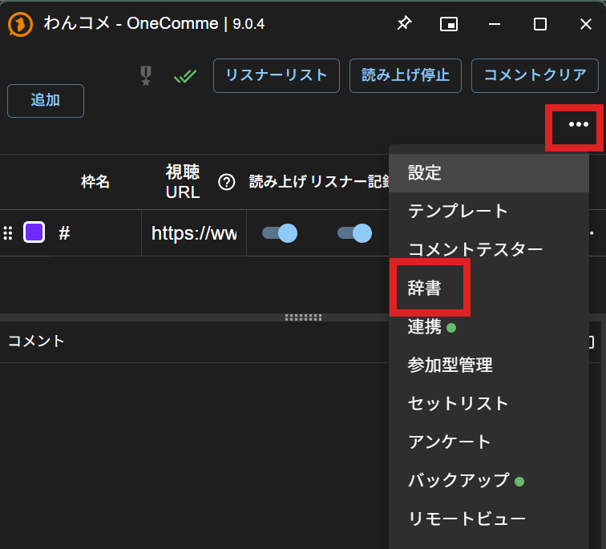
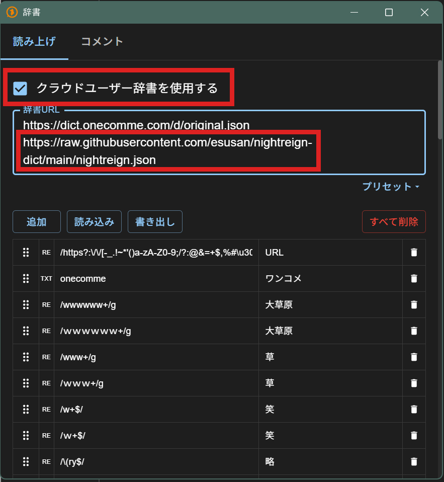

# nightreign-dict

ELDEN RING NIGHTREIGN の配信でよく出てくる用語を、わんコメの読み上げが正しく読めるようにするためのクラウドユーザー辞書です。

現在 710 語収録（`nightreign.json`）。

## 使い方（わんコメ側の設定）

1. わんコメ右上の「...」メニューから「辞書」を開く

   

2. 辞書ウィンドウの「読み上げ」タブで「クラウドユーザー辞書を使用する」にチェックを入れ、辞書URL欄に以下を追加する

   ```
   https://raw.githubusercontent.com/esusan/nightreign-dict/main/nightreign.json
   ```

   

設定後、わんコメが辞書URLを再取得したタイミング（起動時など）で自動的に反映されます。

## 反映されないときは

わんコメ 9.0.5 以前では、再起動時に辞書URLの設定が正しく読み込まれず読み上げに反映されないことがありました。この不具合は 9.0.6（2026/07/19公開）で修正されています。反映されない場合はまず[わんコメを最新版に更新](https://onecomme.com/docs/guide/update)してください。

## 単語の追加・修正リクエスト

追加してほしい単語や読み間違えている単語を見つけたら、Issueか [X](https://x.com/u_se_nr) まで連絡してください。
